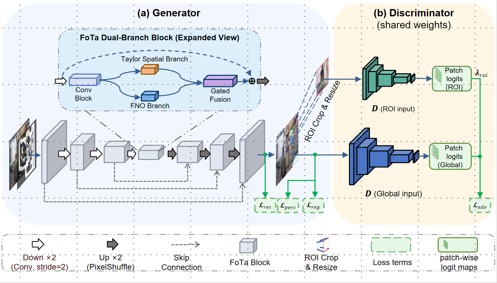

# FoTa-Net

### Boundary-Conditioned Spatial--Spectral Coordination for Large-Mask Image Inpainting

[](https://www.python.org/)
[](https://pytorch.org/)
[](LICENSE)

Official PyTorch implementation of **FoTa-Net**, a deterministic single-pass
inpainting model for irregular large masks. FoTa-Net coordinates a
Taylor-expanded spatial path with a Fourier neural operator (FNO) response and
uses a boundary-conditioned gate to control their contribution before decoding.

**Authors:** Hong Peng, Kehan Wang, Weifa Zheng, Guosheng Lan, and Ying Yu.

<p align="center">
  
</p>

## Highlights

- Shared-feature spatial--spectral coordination for large-mask reconstruction.
- Boundary-conditioned fusion at the generated--known transition.
- Deterministic single-pass inference without iterative diffusion sampling.
- A compact 27.98M-parameter generator with 256, 512, and 1024 configurations.

## Installation

The tested environment uses Python 3.9, PyTorch 2.5.1, torchvision 0.20.1,
and CUDA 12.1.

```bash
git clone https://github.com/khan-wang/FoTa.git
cd FoTa
conda env create -f environment.yml
conda activate fotanet
```

For an existing PyTorch environment:

```bash
pip install -r requirements.txt
```

Install a PyTorch build that matches your CUDA runtime before using the second
route. MMCV is optional; the model falls back to
`torchvision.ops.DeformConv2d` when the MMCV operator is unavailable.

## Pretrained models

The 256-pixel checkpoint folder is available on
[Google Drive](https://drive.google.com/drive/folders/1X6vLWR9ukzFEY1VXR-LjsppxwlVAlEX5?usp=sharing).
See [MODEL_ZOO.md](MODEL_ZOO.md) for standardized filenames, SHA256 checksums,
and the high-resolution release status. Store downloaded files under `weights/`.

Checkpoint files are not committed to Git because each EMA file is about
112 MB.

## Data and masks

Dataset and mask preparation is documented in [DATASETS.md](DATASETS.md).
The main conventions are:

- image and mask manifests contain one path per line;
- white or value-one mask pixels denote the missing region;
- training images follow the `ImageFolder` directory layout;
- mask-bank folders are grouped by hole-area interval.

## Quick inference

Prepare an image file list and a mask file list, then run:

```bash
python inference.py \
  --config config/presets/places2_256.yaml \
  --checkpoint weights/fota_places2_256_seed3407_ema.weights.pth \
  --image_flist data/manifests/images.flist \
  --mask_flist data/manifests/masks.flist \
  --output_dir outputs/demo \
  --img_size 256 \
  --amp
```

Predictions are written to `outputs/demo/pred`. Add `--save_input_gt` to save
the resized input and ground truth beside the predictions. Known pixels are
inserted back by default; use `--no_compositing` only when the raw generator
output is required.

The loader accepts raw state dictionaries and checkpoints containing `emaG`,
`state_dict`, `netG`, `model`, or `generator`.

## Evaluation

Evaluate a FoTa-Net checkpoint on paired image and mask manifests:

```bash
python -m uformer_pytorch.evaluate \
  --model_type ours \
  --config config/presets/places2_256.yaml \
  --checkpoint weights/fota_places2_256_seed3407_ema.weights.pth \
  --eval_manifest data/manifests/images.flist \
  --mask_flist_eval data/manifests/masks.flist \
  --out_dir outputs/eval_places2_256 \
  --img_size 256 \
  --batch_size 8 \
  --num_workers 4 \
  --amp \
  --compute_fid
```

The evaluator reports paired reconstruction metrics by mask-ratio bin and can
also evaluate an external prediction folder with `--model_type folder`. Run
`python -m uformer_pytorch.evaluate --help` for all options.

## Training

Create a machine-local overlay, then start single-GPU training with the public
preset and the overlay applied from left to right:

```bash
python -m uformer_pytorch.train \
  --config config/presets/places2_256.yaml,config/local.yaml \
  --results_dir outputs/places2_256 \
  --seed 3407
```

The untracked overlay contains machine-specific paths and batch sizes:

```yaml
# config/local.yaml
RAW_DATA_ROOT: "/path/to/places2/train"
BATCH_SIZE: 8
NUM_WORKERS: 8
MASK_BANK:
  IRR_ROOT: "/path/to/masks/irregular"
  COCO_ROOT: "/path/to/masks/coco"
HRF_LOSS_WEIGHTS_PATH: "/path/to/perceptual-weights"
```

The 512 and 1024 presets use conservative public batch sizes. Adjust them to
the available GPU memory without changing the architecture fields.
Training also requires the ADE20K ResNet-50 perceptual encoder described in
[DATASETS.md](DATASETS.md).

## Checkpoint export

Training checkpoints contain optimizer and scheduler state. Export an EMA-only
file for inference and release:

```bash
python tools/export_ema_weights.py \
  outputs/run/checkpoints/latest.pth \
  weights/fota_ema.weights.pth
```

Verify every released file against the checksum in [MODEL_ZOO.md](MODEL_ZOO.md).

## Repository layout

```text
FoTa/
  assets/                 paper figures used by this README
  config/                 default configuration, environment overlay, presets
  tools/                  manifest and checkpoint-export utilities
  uformer_pytorch/        model, losses, trainer, and evaluator
  utils/                  AMP, distributed, checkpoint, and reproducibility tools
  inference.py            file-list inference entry point
  DATASETS.md             dataset and mask preparation
  MODEL_ZOO.md            checkpoints and SHA256 hashes
```

## Reproducibility notes

- Use the matching resolution preset and verify the checkpoint hash.
- Keep image--mask pairs and mask polarity fixed across methods.
- FID requires `torch-fidelity`; LPIPS requires `lpips`.
- Exact runtime comparisons require the same device, precision, warm-up, batch
  size, and compositing policy.
- Use `--disable_tf32` in inference when strict TF32-independent comparison is
  required.

## Citation

The manuscript citation will be updated with publication metadata when it is
available. Until then, use:

```bibtex
@misc{peng2026fotanet,
  title  = {FoTa-Net: Boundary-Conditioned Spatial--Spectral Coordination for Large-Mask Image Inpainting},
  author = {Peng, Hong and Wang, Kehan and Zheng, Weifa and Lan, Guosheng and Yu, Ying},
  year   = {2026},
  note   = {Manuscript under review}
}
```

## Acknowledgements

This implementation builds on ideas and limited code patterns from LaMa,
ZITS++, and Uformer. See [THIRD_PARTY_NOTICES.md](THIRD_PARTY_NOTICES.md) for
the exact attribution and license boundary.

## License

FoTa-Net is released under the [Apache License 2.0](LICENSE).
